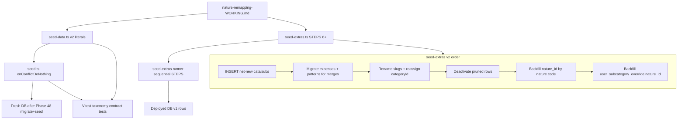

# Phase 47: taxonomy-seed-rework - Research

**Researched:** 2026-06-11
**Domain:** Seed authorship — v2 taxonomy baseline (`seed-data.ts`) + additive deployed-DB transforms (`seed-extras.ts`)
**Confidence:** HIGH

## Summary

Phase 47 è **solo authoring di seed script**: nessuna migration SQL, nessun `yarn db:seed` / `yarn db:seed-extras` in fase di consegna (D-05). Il deliverable è una tassonomia v2 allineata a `.planning/nature-remapping-WORKING.md` con `natureId` FK (1–8) su ogni sottocategoria di sistema, più STEPS additive in `seed-extras.ts` per DB già deployati con il baseline v1.

**Stato attuale verificato nel codebase** [VERIFIED: codebase grep + yarn tsx import]:
- `scripts/seed-data.ts`: **27 categorie**, **130 sottocategorie**, **29 pattern** di categorizzazione; **0** sottocategorie con `natureId`; tutti i pattern referenziano slug esistenti; tutti i 29 pattern hanno ancora `amountSign` nel literal (rimosso solo a insert-time in `seed.ts`).
- `scripts/seed-extras.ts`: 5 STEPS; **step 1 è rotto** — esegue `UPDATE sub_category SET nature = …` via raw SQL su colonna eliminata in Phase 46; step 3–4 contengono l'idioma merge→migrate expenses/patterns→deactivate da riusare per v2.
- `scripts/seed.ts`: inserisce `directions`/`natures` prima di categories; strip `category.type` a insert; risolve `subCategoryId` per pattern da slug; **non** passa `natureId` alle sottocategorie.
- Test che importano `seed-data`: solo `tests/import-detector.test.ts` (platforms). Scaffold R-FN-03 in `tests/category-settings-seed.ts` con 3 `it.todo` da abilitare.

**Primary recommendation:** Due binari paralleli — (1) **sostituzione wholesale** di `categories` + `subCategories` + aggiornamento `categorizationPatterns` in `seed-data.ts` con `natureId` esplicito; (2) **append** di STEPS v2 in `seed-extras.ts` che seguono l'ordine migrate→rename→deactivate→backfill `nature_id`, con step 1 reso no-op. Validazione via nuovo test Vitest statico sui shape export + build/typecheck green.

<user_constraints>
## User Constraints (from CONTEXT.md)

### Locked Decisions

#### A — Locked taxonomy (do NOT re-derive)
- **D-01:** Final remap is **certified** in `.planning/nature-remapping-WORKING.md` (2026-06-09): 4 IN + 16 OUT + 2 ALLOCATION + 1 TRANSFER categories; ~65 subcategories; 8 natures (`income`, `income_extraordinary`, `essential`, `discretionary`, `debt`, `transfer`, `savings`, `investment`). Uncategorized = `nature_id NULL`.
- **D-02:** Dissolutions/renames per working doc: `operational` dissolved; `financial`→`investment`, `extraordinary`→`savings`; wrapper cats (Assicurazioni, Abbonamenti, Famiglia) distributed; Risparmio+Investimenti → ALLOCATION; liquidità/bonifici → TRANSFER.
- **D-03:** Pruning principle: minimise categories/subcats; merges listed in working doc are authoritative; dropped slugs (overtime, rimborso-*, store-type splits) must be deactivated or not re-seeded.

#### B — Phase 47 ↔ Phase 46 / 48 boundary
- **D-04:** Phase 46 shipped schema (`sub_category.nature_id` FK), lookup rows (`direction` 4 + `nature` 8) in `seed-data.ts`, and build-survival seed repairs. Phase 47 **does not** re-open schema or lookup row definitions.
- **D-05:** **No `drizzle-kit generate` / DB apply** in Phase 47 (same as D-06 in Phase 46). Done = seed scripts + tests/build green. Physical DB transform is Phase 48.
- **D-06:** `seed-extras` step 1 (`setSubcategoryNature`) is **broken** post-Phase 46 (`sub_category.nature` column removed). Phase 47 must replace it with `nature_id` FK backfill — not defer to Phase 49.

#### C — Additive seed model (resolve the tension)
- **D-07:** **Fresh-install baseline:** `seed-data.ts` `categories` + `subCategories` arrays are **replaced wholesale** with the v2 taxonomy (new slugs, merges, `natureId` on every subcategory). Rationale: v2.0 milestone; old 26-cat/~120-subcat baseline is obsolete for new environments. Phase 46 already established that **new table blocks** in seed-data are allowed; a milestone-level taxonomy replacement is the same class of change as the working-doc contract — not "adding a column to an already-shipped shape."
- **D-08:** **Deployed DBs:** all transforms on rows that already exist from the v1 baseline insert (`onConflictDoNothing`) go through **new additive STEPS** in `seed-extras.ts`: slug rename map, merge migrations (expense/pattern pointers per step 3 idiom), `isActive=false` for pruned slugs, INSERT for net-new slugs/categories, `nature_id` UPDATE by slug→nature code lookup.
- **D-09:** Do **not** edit historical STEPS 1–5 bodies except where they fail to compile (build-survival). Append new STEPS for v2 remap; obsolete step 1 becomes no-op or is superseded by a new step that sets `nature_id`.
- **D-10:** `categorization_pattern` rows in `seed-data.ts` must remain **sign-agnostic** (no `amountSign`); remap step must update `subCategoryId` when subcategory slugs merge (Phase 48 may also handle — but seed-extras should cover pattern pointer fixes for taxonomy merges).

#### D — nature_id wiring
- **D-11:** `natureId` on subcategories in `seed-data.ts` uses explicit integer IDs matching the `natures` array in seed-data (1–8), same idiom as Phase 46 `directionId` on natures.
- **D-12:** `seed-extras` backfill resolves nature by **code** (`essential`, `savings`, etc.) via SELECT from `nature` table — never hardcode stale enum strings.
- **D-13:** System subcategories (`trasferimento`, `addebito-carta-di-credito`) get `nature_id` for `transfer`; `excludeFromTotals` stays until Phase 49 (D-10 from Phase 46).

### Claude's Discretion
- Exact STEP ordering/wave split in seed-extras (rename before merge vs category dissolution order), test fixture updates, and whether to add a taxonomy validation script are left to research/planning.

### Deferred Ideas (OUT OF SCOPE)
- Transaction recategorization for misclassified rows (vendita-investimenti, etc.) → Phase 48
- Pattern sign-agnostic DB migration → Phase 48 (46-03 repaired seed-extras dedupe only)
- `exclude_from_totals` removal → Phase 49
</user_constraints>

<phase_requirements>
## Phase Requirements

| ID | Description | Research Support |
|----|-------------|------------------|
| TAX-01 | Seeded taxonomy matches working-doc final remap: 23 cat / ~65 sub across IN(4), OUT(16), ALLOCATION(2), TRANSFER(1); ogni sub con nature corretta | Wholesale `seed-data.ts` replacement + static Vitest contract test; working doc sezioni IN/OUT/ALLOCATION/TRANSFER come checklist |
| TAX-02 | Dissolutions/renames per working doc (operational dissolved, financial→investment, extraordinary→savings, wrapper distributed, ALLOCATION/TRANSFER folds) | `seed-extras` STEPS 6+ con mappe slug merge/rename/deactivate documentate sotto; step 3–4 idiom come template |
| TAX-03 | `seed-data.ts` nuovo baseline + `seed-extras.ts` additive step(s) per `nature_id` su righe esistenti | Step 1 no-op + step finale `backfill-nature-id-v2`; `natureId` su ogni sub in seed-data; D-07 risolve tensione REQUIREMENTS "no edit shipped shapes" |
</phase_requirements>

## Architectural Responsibility Map

| Capability | Primary Tier | Secondary Tier | Rationale |
|------------|-------------|----------------|-----------|
| v2 taxonomy literals (cat/sub/pattern) | Database / Storage (seed scripts) | — | `seed-data.ts` è la fonte baseline idempotente |
| `natureId` FK su system subcategories | Database / Storage | — | Colonna su `sub_category`; valorizzata in seed + extras |
| Deployed-DB slug remap (rename/merge/deactivate) | Database / Storage (seed-extras) | — | Operator script post-`db:seed`; non app runtime |
| Pattern `subCategoryId` pointer fix | Database / Storage (seed-extras) | — | FK su `categorization_pattern`; merge prima di deactivate |
| `user_subcategory_override.nature_id` backfill | Database / Storage (seed-extras) | — | FK parallela a `sub_category.nature_id` |
| Taxonomy validation tests | Test layer (Vitest) | — | Assert statici su export seed-data; no DB in Phase 47 gate |
| Direction/nature lookup rows | Database / Storage (seed-data) | — | **Out of scope** — già Phase 46; non modificare |

## Standard Stack

### Core

| Library | Version | Purpose | Why Standard |
|---------|---------|---------|--------------|
| `drizzle-orm` | ^0.45.2 [VERIFIED: package.json] | Typed UPDATE/INSERT in seed-extras | Già usato in seed.ts / seed-extras.ts |
| `pg` | ^8.20.0 [VERIFIED: package.json] | Pool PostgreSQL operator scripts | Pattern esistente |
| `tsx` | ^4.21.0 [VERIFIED: package.json] | Esecuzione script seed | `yarn db:seed*` |
| Vitest | ^4.1.5 [VERIFIED: package.json] | Test statici taxonomy contract | `yarn test` |

### Supporting

| Library | Version | Purpose | When to Use |
|---------|---------|---------|-------------|
| `sql` tagged template (drizzle-orm) | (bundled) | Backfill `nature_id` via subquery `SELECT id FROM nature WHERE code = …` | seed-extras quando serve subquery correlata |
| `eq`, `and`, `inArray`, `isNull` (drizzle-orm) | (bundled) | Merge migrations step 3-style | expense/pattern pointer updates |

### Alternatives Considered

| Instead of | Could Use | Tradeoff |
|------------|-----------|----------|
| Append seed-extras STEPS | Single monolithic SQL migration file | Viola modello additive seed + D-09; migration è Phase 48 |
| Edit STEPS 1–5 in place | Append + no-op step 1 | Edit storico viola D-09; no-op step 1 è il minimo build-survival |
| Hardcoded nature_id integers in extras | Lookup by `nature.code` | Hardcode fragile se ordine insert cambia; D-12 impone lookup by code |

**Installation:** Nessun pacchetto nuovo richiesto.

## Package Legitimacy Audit

> Phase 47 non introduce dipendenze npm nuove.

| Package | Verdict | Disposition |
|---------|---------|-------------|
| *(none)* | — | N/A |

**Packages removed due to [SLOP] verdict:** none
**Packages flagged as [SUS]:** none

## Project Constraints (from CLAUDE.md / AGENTS.md)

- **Additive seed model:** baseline `seed-data.ts` + `seed-extras.ts` STEPS append-only (D-09); milestone wholesale replace di categories/subCategories autorizzato (D-07).
- **No migration in Phase 47:** no `drizzle-kit generate`, no `scripts/migrate.ts`, no `yarn db:seed*` apply.
- **Monetary / language:** N/A per questa fase (no import/money logic).
- **Layers:** seed scripts in `scripts/` only; no DAL/services changes.
- **Italian:** nomi/slug prodotto in italiano nei seed; commenti developer in inglese.
- **Pattern sign-agnostic:** rimuovere `AmountSign` / `amountSign` da `categorizationPatterns` literal (D-10); già stripped a insert in `seed.ts`.

## Architecture Patterns

### System Architecture Diagram



### Recommended Project Structure

```text
scripts/
├── seed-data.ts      # v2 categories (23), subCategories (~65), patterns (updated slugs), natureId on subs
├── seed-extras.ts    # STEPS 1 no-op + STEPS 6+ v2 remap/backfill
└── seed.ts           # insert wiring; pass natureId; strip category.type; resolve pattern slugs

tests/
├── seed-taxonomy.test.ts          # NEW — TAX-01/02/03 static contract
└── category-settings-seed.ts      # Enable R-FN-03 todos (import subCategories from seed-data)
```

### Pattern 1: `natureId` on baseline subcategories (fresh install)

**What:** Ogni voce in `subCategories` include `natureId: 1..8` allineato a `natures` array esistente.
**When to use:** Authoring seed-data v2 (D-11).
**Example:**

```typescript
// Idiom from Phase 46 directions/natures (scripts/seed-data.ts L1579+)
// Nature IDs: 1=income, 2=income_extraordinary, 3=essential, 4=discretionary,
//             5=debt, 6=transfer, 7=savings, 8=investment
{
  categoryId: 7,
  name: "carburante e ricarica",
  slug: "carburante-e-ricarica",
  natureId: 3, // essential
  displayOrder: 0,
  isActive: true,
}
```

### Pattern 2: Backfill `nature_id` by code (deployed DB)

**What:** UPDATE via subquery su tabella `nature`, mai stringhe enum stale.
**When to use:** Step finale seed-extras dopo remap slug (D-12).
**Example:**

```typescript
// Source: existing seed-extras.ts raw SQL idiom (adapted for nature_id)
await database.execute(sql`
  UPDATE sub_category
  SET nature_id = (SELECT id FROM nature WHERE code = ${natureCode})
  WHERE slug = ANY(${slugs}) AND user_id IS NULL
`)
```

### Pattern 3: Merge migration (step 3 idiom)

**What:** Per ogni merge slug A→B: (1) resolve IDs by slug, (2) UPDATE expense, (3) dedupe+UPDATE categorization_pattern, (4) deactivate A.
**When to use:** Ogni merge del working doc su DB deployato (D-08, D-10).
**Reference:** `reorganizeSpesaSubcategories` in `scripts/seed-extras.ts` L235–346 [VERIFIED: codebase].

### Pattern 4: Idempotent rename guard

**What:** Se slug target esiste già, deactivate source invece di rename (unique `sub_category_system_category_slug_unique`).
**When to use:** Tutti i rename in seed-extras (già in step 3–4).
**Reference:** `reorganizeTransferRimborsiCategories` L363–383 [VERIFIED: codebase].

### Anti-Patterns to Avoid

- **Backfill `nature_id` prima dei merge:** pointer expense/pattern restano su slug deprecati; nature su righe soon-deactivated.
- **Deactivare prima di migrare:** step 3 comment L237–238 — expense spariscono da listing.
- **Due pattern "bonifico" sullo stesso subCategoryId:** dopo merge IN+OUT bonifici → `trasferimento-tra-conti`, dedupe per unique `(pattern, subCategoryId)`.
- **Edit massivo STEPS 2–5:** viola D-09; solo step 1 no-op per compile/runtime survival.
- **Rimuovere `category.type` dal literal seed-data:** Phase 46 map-out a insert-time; mantenere literal per riferimento storico finché non si pulisce consapevolmente.

## Don't Hand-Roll

| Problem | Don't Build | Use Instead | Why |
|---------|-------------|-------------|-----|
| Slug→nature mapping su DB deployato | CSV one-off script | Record `slug → nature.code` in seed-extras step | Idempotenza, reviewability, STEPS registry |
| Pattern dedupe on merge | Custom DELETE all | Subquery conflict delete (step 3 L320–328) | Rispetta unique `(pattern, subCategoryId)` |
| Taxonomy count validation | Manual spreadsheet | Vitest test on exported arrays | Regression gate per TAX-01 |
| Category direction assignment | `category.type` column | `natureId` → join `nature.direction_id` | ADR 0012; type column removed |

**Key insight:** Il working doc è la source of truth semantica; il codice deve solo materializzarla in due binari (fresh literal vs deployed STEPS), non re-derivare merge.

## Runtime State Inventory

> Phase 47 authora script; l'inventario descrive cosa resta in runtime **dopo Phase 48 apply** se seed-extras non gira.

| Category | Items Found | Action Required |
|----------|-------------|------------------|
| Stored data | PostgreSQL: 27 system categories, 130 system subcategories (IDs serial, category IDs 1–34 espliciti nel baseline), 29 system patterns, expenses/patterns puntati a slug v1 | seed-extras STEPS 6+ (Phase 48 apply); **non** seed-data alone su DB esistente |
| Stored data | `sub_category.nature_id` NULL su tutte le righe v1 post-migrate Phase 48 | backfill step seed-extras |
| Stored data | `user_subcategory_override.nature_id` NULL | backfill join da sub_category o map dedicata |
| Live service config | None — taxonomy only in DB | — |
| OS-registered state | None — verified by codebase search | — |
| Secrets/env vars | `DATABASE_URL` / `STAGING_DATABASE_URL` / `PRODUCTION_*` per run operator (Phase 48) | Phase 47: code-only, no env mutation |
| Build artifacts | `seed-data.ts` export shapes consumati da `seed.ts` + future tests | Re-run `yarn test` + `yarn build` after edit |

**Nothing found in category:** OS-registered state, live external config.

## Current Baseline Inventory (pre-v2)

[VERIFIED: yarn tsx import 2026-06-11]

| Metric | Current | v2 Target (working doc) |
|--------|---------|-------------------------|
| Categories | 27 | 23 |
| Subcategories | 130 | ~65 (see Open Questions — list detail sums higher) |
| Categorization patterns | 29 | ~25–29 (slug retarget, dedupe bonifico) |
| Subcategories with `natureId` | 0 | all active system subs |
| Category explicit IDs | 1–34 (gaps: 6,16,17,20,29–31) | Reuse IDs where row survives; INSERT new for 🆕 cats |

### Tests / fixtures depending on old slugs

| File | Dependency | Phase 47 action |
|------|------------|-----------------|
| `tests/import-detector.test.ts` | `platforms` only | No change |
| `tests/category-settings-seed.ts` | Dynamic DB seed; R-FN-03 todos reference FlowNature | Enable todos importing `subCategories` from seed-data |
| `tests/cascade-options.test.ts` | Inline minimal fixture (not seed-data) | No change unless discretion adds shared fixture |
| `tests/categories-dal.test.ts` | Mocks with `operational` nature | Out of Phase 47 scope (Phase 49 semantic rewrite) |
| All other `*.test.tsx` | Inline taxonomy mocks | No seed-data slug dependency |

### Pattern slug → v2 retarget map

Slugs attuali referenziati da `categorizationPatterns` [VERIFIED: seed-data.ts]:

| Current pattern slug | v2 target slug | Notes |
|---------------------|----------------|-------|
| `supermercato` | `spesa-quotidiana` | merge |
| `negozio-di-quartiere` | `spesa-quotidiana` or deactivate pattern | store-type split dropped |
| `elettronica` | `elettronica` | keep |
| `cene-fuori` | `ristoranti` | merge |
| `colazioni-e-snack` | `bar-caffe-e-snack` | merge (2 patterns) |
| `energia-elettrica` | `energia-elettrica` | cat → `utenze` |
| `carburante` | `carburante-e-ricarica` | rename |
| `treno` | `mezzi-pubblici` or drop pattern | `treno` pruned from OUT |
| `pedaggi-autostradali` | `pedaggi-e-parcheggi` | merge |
| `taxi-e-ride-sharing` | `taxi-e-ride-sharing` | keep |
| `streaming-video`, `streaming-musica` | `streaming` | merge → Cultura |
| `farmaci-generici` | `farmaci` | merge |
| `visite-mediche` | `visite-mediche` | keep |
| `sport` | `sport-e-fitness` | rename |
| `altri-abbonamenti` | deactivate or `app-e-software` / `corsi` | subcat dropped |
| `servizi-telefonici-e-internet` | `telefono-e-internet` | move to Utenze |
| `bonifico-in-uscita`, `bonifico-in-entrata` | `trasferimento-tra-conti` | merge + **dedupe** to one pattern per slug |
| `commissioni-bancarie` | `commissioni-e-canone-conto` | rename |
| `finanziamenti-auto` | `finanziamenti-auto` | keep |
| `altri-finanziamenti` | `altri-finanziamenti` | keep |
| `stipendio-base` | `stipendio-base` | keep |
| `imposte` | `imposte` | keep |
| `take-away` | `take-away-e-delivery` | rename (2 patterns) |

Remove `amountSign` / `AmountSign` type from pattern literals when retargeting (D-10).

### seed-extras STEP design (recommended append)

| Step name | Purpose | Depends on |
|-----------|---------|------------|
| *(step 1 stub)* | Replace `setSubcategoryNature` body with no-op + log (D-06, D-09) | — |
| `v2-insert-categories-subcategories` | INSERT 🆕 cats (`pensioni-e-sussidi`, `servizi-professionali`, `animali`, …) + subs assenti da v1 | nature rows exist (Phase 48 seed) |
| `v2-migrate-merges-out` | expense + pattern migrations OUT merges (es. `supermercato`→`spesa-quotidiana`, wrapper dissolutions) | IDs resolved by slug |
| `v2-migrate-merges-in-allocation-transfer` | IN merges (`dividendi-*`→`dividendi`), ALLOCATION (`azioni`→`titoli-e-fondi`), TRANSFER (`bonifico-*`→`trasferimento-tra-conti`) | step 4 partial already done for transfer |
| `v2-rename-categories-subcategories` | Category renames (`bollette-e-utilita`→`utenze`, `income-finanziari`→`rendite`, …) | — |
| `v2-deactivate-pruned` | `isActive=false` on dropped slugs/cats (2,3,18,22,23,26,27,28,34, overtime, rimborso-*, store splits, …) | **after** migrations |
| `v2-backfill-nature-id` | Map v2 slug → `nature.code` → UPDATE `nature_id` | all renames complete |
| `v2-backfill-override-nature-id` | `UPDATE user_subcategory_override SET nature_id = sc.nature_id FROM sub_category sc WHERE …` | sub nature_id set |

**Ordering rationale:** INSERT net-new → migrate FK pointers → rename → deactivate → backfill. Step 4 (`reorganize-transfer-rimborsi`) already partially implements TRANSFER; v2 step completes `prelievo-contante`→`contante`, folds cat 34, merges bonifici — **do not duplicate**; v2 step should extend/idempotently finish.

### Category-level dissolve/deactivate (deployed DB)

Categories to deactivate (`isActive=false`) after subs migrated [source: working doc]:
- `abbonamenti` (2), `assicurazioni` (3), `famiglia` (18), `libri-e-media` (22), `tempo-libero` (23), `sconti-rimborsi-e-cashback` / merged (26), `vendite-e-dismissioni` (27), `movimenti-di-liquidita` (28), `bonifici-e-rimborsi` (34)

Categories repurposed (rename + subs restructured, stay active):
- `risparmio` (1) → ALLOCATION/savings subs
- `investimenti` (12) → ALLOCATION/investment subs
- `ignore` / `trasferimenti` (32) → TRANSFER (step 4 started)
- `income-finanziari` (25) → `rendite`
- `bollette-e-utilita` (13) → `utenze`
- `tasse-imposte-e-commissioni` (15) → `imposte-e-oneri`
- `regali` (5) → `regali-e-donazioni`
- Merge 22+23 → `cultura-e-tempo-libero` (new slug, new or reused ID)

🆕 INSERT categories: `pensioni-e-sussidi`, `servizi-professionali`, `animali`, `entrate-straordinarie` (if not repurposing 26).

### Recommended plan wave split

| Wave | Scope | Verification |
|------|-------|--------------|
| **0** | Add `tests/seed-taxonomy.test.ts` scaffold (RED) | `yarn test tests/seed-taxonomy.test.ts` fails |
| **1** | `seed-data.ts` v2 categories + subCategories + `natureId`; remove pattern `amountSign` | Wave 0 tests GREEN; `yarn tsc --noEmit` |
| **2** | `categorizationPatterns` slug retarget + `seed.ts` pass-through `natureId` + transfer `excludeFromTotals` slugs update | `seed.ts` compile; pattern missing-slug guard passes |
| **3** | `seed-extras.ts` step 1 no-op + STEPS 6+ (split 2–3 plans if large) | Typecheck; optional dry-run doc for Phase 48 |
| **4** | Enable R-FN-03 todos in `category-settings-seed.ts`; full `yarn test` + `yarn build` | CI-equivalent gate |

## Common Pitfalls

### Pitfall 1: Step 1 runtime failure on Phase 48
**What goes wrong:** `UPDATE sub_category SET nature = …` errors — column dropped.
**Why:** Phase 46 removed column; step 1 not updated.
**How to avoid:** No-op step 1 in Wave 3 (D-06).
**Warning signs:** `seed-extras` fails at first step.

### Pitfall 2: Deactivate before migrate
**What goes wrong:** Expenses orphaned from active taxonomy queries.
**Why:** `isActive=false` hides subs before pointer migration.
**How to avoid:** Strict order migrate→deactivate (step 3 comment).
**Warning signs:** Dashboard missing historical grocery expenses post-extras.

### Pitfall 3: Bonifico pattern unique violation
**What goes wrong:** Two `bonifico` patterns same `subCategoryId` after merge.
**Why:** v1 had separate IN/OUT slugs; v2 single `trasferimento-tra-conti`.
**How to avoid:** Conflict delete then single pattern row in seed-data; extras dedupe on migrate.
**Warning signs:** `categorization_pattern_unique` violation on seed insert.

### Pitfall 4: Fresh seed vs deployed DB divergence
**What goes wrong:** Editing only seed-data leaves production rows at v1 slugs.
**Why:** `onConflictDoNothing` skips updates.
**How to avoid:** D-08 STEPS for all v1 row transforms; never assume seed.ts updates existing.
**Warning signs:** Staging still shows 130 subs after `db:seed` without extras.

### Pitfall 5: Hardcoded nature_id in extras
**What goes wrong:** Wrong FK if nature insert order changes.
**Why:** Integer assumption without lookup.
**How to avoid:** D-12 subquery by `nature.code`.
**Warning signs:** Subs show wrong nature label in UI.

### Pitfall 6: Subcount mismatch vs working doc
**What goes wrong:** Test expects 65 subs; implemented list has ~75–87.
**Why:** Working doc summary approximate vs detailed bullets.
**How to avoid:** Test asserts **exact list from working doc bullets**, not summary round number only.
**Warning signs:** TAX-01 ambiguity during verify-work.

## Code Examples

### seed.ts — insert subCategory with natureId

```typescript
// scripts/seed.ts L89-91 — extend to pass natureId from seed-data shape
await db.insert(subCategory).values(subCategories as Array<typeof subCategory.$inferInsert>).onConflictDoNothing()
// Ensure subCategories entries include natureId: number | undefined (null = uncategorized — none for v2 system subs except none planned)
```

### Transfer excludeFromTotals (update slugs post-v2)

```typescript
// scripts/seed.ts L93-97 — update slug list for v2 TRANSFER subs
await db.update(subCategory).set({ excludeFromTotals: true }).where(inArray(subCategory.slug, [
  'trasferimento-tra-conti',
  'addebito-carta-di-credito',
  'contante', // was prelievo-contante in step 4
]))
```

### Vitest taxonomy contract (Wave 0)

```typescript
import { categories, subCategories, natures } from '../scripts/seed-data'

const NATURE_BY_ID = Object.fromEntries(natures.map((n) => [n.id, n.code]))

it('TAX-01: has 23 active system categories', () => {
  expect(categories.filter((c) => c.isActive !== false)).toHaveLength(23)
})

it('TAX-01: every system subcategory has natureId 1-8', () => {
  for (const sub of subCategories) {
    expect(sub.natureId, sub.slug).toBeGreaterThanOrEqual(1)
    expect(sub.natureId, sub.slug).toBeLessThanOrEqual(8)
    expect(NATURE_BY_ID[sub.natureId!]).toBeTruthy()
  }
})
```

## State of the Art

| Old Approach | Current Approach | When Changed | Impact |
|--------------|------------------|--------------|--------|
| `sub_category.nature` enum string | `sub_category.nature_id` FK → `nature.code` | Phase 46 schema | seed-extras step 1 obsolete |
| `category.type` for direction | Derived: sub → nature → direction | ADR 0012 / Phase 46 | seed.ts strips `type` at insert |
| `categorization_pattern.amount_sign` | Sign-agnostic `(pattern, subCategoryId)` | Phase 46 | Remove amountSign from seed-data literals |
| 27 cat / 130 sub baseline | 23 cat / ~65 sub v2 | Phase 47 | Wholesale seed-data + extras remap |
| `operational` / `financial` / `extraordinary` | dissolved / `investment` / `savings` | nature-remapping-WORKING.md | NATURE_SLUGS in step 1 is documentation-only |

**Deprecated/outdated:**
- `NATURE_SLUGS` + `setSubcategoryNature` targeting `nature` column — replace with no-op + v2 backfill step.
- `FlowNature` string UPDATEs in steps 3–5 — raw SQL `SET nature =` will fail post-migrate; steps 3–5 **historical** for already-run envs; new backfill step 6+ sets `nature_id` idempotently (D-09: avoid editing 3–5 bodies unless compile failure).

## Assumptions Log

| # | Claim | Section | Risk if Wrong |
|---|-------|---------|---------------|
| A1 | Working doc "~65 subcategories" is approximate; detailed bullets sum to ~75–87 | Open Questions | TAX-01 acceptance criteria ambiguous |
| A2 | STEPS 3–5 raw SQL `SET nature` can remain unchanged if Phase 48 migration drops column before extras re-run on fresh env | Pitfall 6 / State of Art | Fresh Phase 48 env fails mid-extras unless steps 3–5 get build-survival edit |
| A3 | Reuse category explicit IDs where possible reduces extras complexity | STEP design | FK conflicts if ID repurposed for different semantic cat |
| A4 | `prelievo-contante` slug becomes `contante` per working doc TRANSFER section | Pattern map | step 4 already inserted `prelievo-contante`; v2 rename needed |

## Open Questions (RESOLVED)

1. **Exact subcategory count for TAX-01** — RESOLVED: Plan 01 locks explicit `V2_SUBCATEGORY_MANIFEST` in `tests/fixtures/v2-taxonomy-manifest.ts`; acceptance is manifest-driven, not "~65" round number.
2. **STEPS 3–5 post-migrate survivability** — RESOLVED: Plan 04 adds build-survival no-op for step 1 + STEPS 6+; STEPS 3–5 bodies unchanged per D-09; Phase 48 dry-run validates runtime on fresh DB.
3. **Vitest-only vs DB integration validation** — RESOLVED: Phase 47 gate is static Vitest + `yarn build`; live seed-extras apply deferred to Phase 48 (D-05).

## Environment Availability

> Phase 47 deliverable is source-only. DB required only for Phase 48 manual verification.

**Step 2.6:** SKIPPED for Phase 47 execution gate — no external dependencies beyond existing toolchain (Node, yarn, vitest, tsc).

| Dependency | Required By | Available | Version | Fallback |
|------------|------------|-----------|---------|----------|
| Node.js | tsx / vitest | ✓ | v22+ (local) | — |
| yarn | test/build | ✓ | 4.14.1 | — |
| PostgreSQL | Phase 48 seed apply only | — | — | Not needed for Phase 47 done criteria |

## Validation Architecture

### Test Framework

| Property | Value |
|----------|-------|
| Framework | Vitest ^4.1.5 |
| Config file | `vitest.config.ts` |
| Quick run command | `yarn test tests/seed-taxonomy.test.ts` |
| Full suite command | `yarn test` |
| Build gate | `yarn build` (includes tsc via Next) |

### Phase Requirements → Test Map

| Req ID | Behavior | Test Type | Automated Command | File Exists? |
|--------|----------|-----------|-------------------|-------------|
| TAX-01 | 23 categories, subs match working-doc nature assignments | unit (static) | `yarn test tests/seed-taxonomy.test.ts` | ❌ Wave 0 |
| TAX-01 | Every sub has valid `natureId` 1–8 | unit (static) | same | ❌ Wave 0 |
| TAX-02 | Dissolved wrapper cats absent/deinactive in seed baseline | unit (static) | same — assert slugs not in active set | ❌ Wave 0 |
| TAX-03 | `seed-extras` exports STEPS including backfill step name | unit (static smoke) | `yarn test tests/seed-extras-steps.test.ts` optional | ❌ Wave 0 optional |
| TAX-03 | R-FN-03 nature assignment todos | unit | `yarn test tests/category-settings-seed.ts` | ❌ enable todos Wave 4 |
| Build | seed scripts compile against Phase 46 schema | integration | `yarn build` | ✅ existing |

### Sampling Rate

- **Per task commit:** `yarn test tests/seed-taxonomy.test.ts`
- **Per wave merge:** `yarn test`
- **Phase gate:** `yarn test` + `yarn build` green before `/gsd-verify-work`

### Wave 0 Gaps

- [ ] `tests/seed-taxonomy.test.ts` — TAX-01/02 static contract (category count, slug manifest, natureId)
- [ ] Enable `it.todo` in `tests/category-settings-seed.ts` — R-FN-03
- [ ] Optional: `tests/seed-extras-steps.test.ts` — assert STEPS registry contains `v2-backfill-nature-id`
- [ ] Remove or migrate `AmountSign` type from `seed-data.ts` when patterns updated (D-10)

## Security Domain

### Applicable ASVS Categories

| ASVS Category | Applies | Standard Control |
|---------------|---------|------------------|
| V2 Authentication | no | — |
| V3 Session Management | no | — |
| V4 Access Control | no | — |
| V5 Input Validation | no (operator scripts) | Parameterized SQL via drizzle `sql` template |
| V6 Cryptography | no | — |

### Known Threat Patterns

| Pattern | STRIDE | Standard Mitigation |
|---------|--------|---------------------|
| SQL injection in seed-extras | Tampering | Drizzle parameterized queries; no string concat of operator input |
| Production seed misfire | Denial of service / Tampering | Existing `PRODUCTION_MIGRATION_CONFIRM` gate in db-config [VERIFIED: seed-extras.ts uses resolveOperatorDatabaseTarget] |
| Idempotent step double-apply | Integrity | Slug guards + onConflictDoNothing patterns from step 3–4 |

## Sources

### Primary (HIGH confidence)
- `.planning/nature-remapping-WORKING.md` — final taxonomy contract
- `.planning/phases/47-taxonomy-seed-rework/47-CONTEXT.md` — locked decisions D-01–D-13
- `scripts/seed-data.ts`, `scripts/seed-extras.ts`, `scripts/seed.ts` — [VERIFIED: codebase read + tsx import]
- `.planning/phases/46-direction-nature-schema/46-03-SUMMARY.md` — directions/natures seed pattern

### Secondary (MEDIUM confidence)
- `CLAUDE.md` seed rules — additive model, Phase boundaries
- `lib/db/schema.ts` — `sub_category.natureId`, unique indexes

### Tertiary (LOW confidence)
- A2 — STEPS 3–5 survivability on fresh post-migrate DB without edits [ASSUMED — needs Phase 48 dry-run confirmation]

## Metadata

**Confidence breakdown:**
- Standard stack: HIGH — no new deps; existing seed idioms
- Architecture: HIGH — working doc + step 3–4 templates verified in repo
- Pitfalls: MEDIUM — subcount ambiguity and STEPS 3–5 post-migrate behavior

**Research date:** 2026-06-11
**Valid until:** 2026-07-11 (stable seed domain; 7 days if extras STEP split changes during planning)

## RESEARCH COMPLETE
