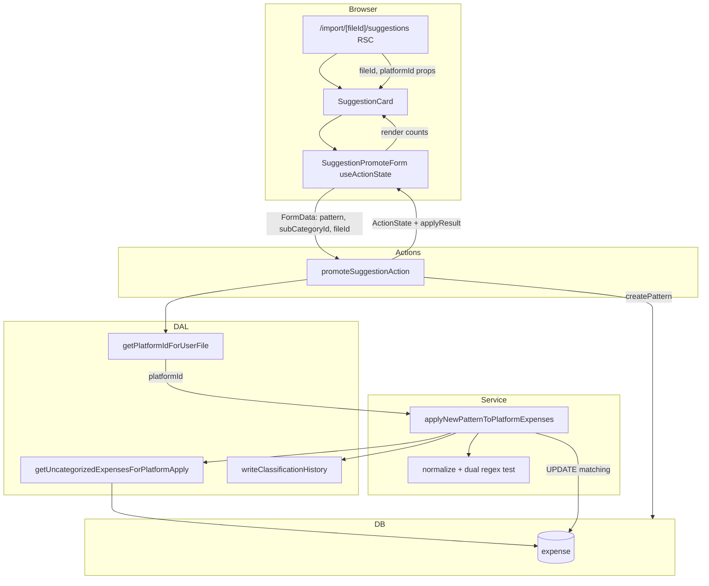

# Phase 53: retroactive-application - Research

**Researched:** 2026-06-16
**Domain:** Platform-scoped retroactive regex application + inline promotion feedback
**Confidence:** HIGH

## Summary

Phase 53 closes the loop between discovery promotion and persisted Set B: when a user promotes a discovered regex via `promoteSuggestionAction`, the system must retroactively categorize matching **platform-scoped** uncategorized expenses (not user-wide), return `{ updatedCount, notUpdatedCount }`, and surface those counts inline on the suggestion card while the page stays open.

The codebase already has the critical building blocks from Phase 51: `getUncategorizedExpensesForDiscovery` in `lib/dal/regex-discovery.ts` implements the authoritative `expense → file → importFormatVersion → platform` join with `isNull(expense.subCategoryId)` and `eq(platform.id, platformId)`. `applyNewPatternToExpenses` in `lib/services/pattern-application.ts` already performs the matcher loop (normalized + numeric-stripped dual test), bulk update, and `writeClassificationHistory` with `source: 'user_pattern'` — but it scans **all** user uncategorized expenses with no platform filter and returns only a `number`. `promoteSuggestionAction` swallows apply failures non-fatally and returns `{ error: null }` with no apply statistics. The suggestion UI uses `useActionState` with the minimal `ActionState` shape `{ error: string | null }` and client-only `promoted` state for the "Pattern creato" badge.

**Primary recommendation:** Add a platform-scoped apply function (extend or sibling to `applyNewPatternToExpenses`) that reuses the Phase 51 DAL join semantics, returns structured counts, wire it only through `promoteSuggestionAction`, resolve `platformId` server-side from `fileId` (with ownership check) on the legacy suggestions page, and extend `ActionState` + suggestion card/form to render persistent inline counts. Leave `createPatternAction` on the legacy user-wide apply path.

<user_constraints>
## User Constraints (from CONTEXT.md)

### Locked Decisions

#### Retroactive write scope (APPLY-02 — RESOLVED)
- **Decision: apply to the entire uncategorized history for the same platform** — not current-file-only, not two explicit user-selectable modes.
- Aligns with Phase 51 **D-03** discovery *read* scope: platform-bounded Set B via `expense → file → importFormatVersion → platform`.
- The promotion entry point must resolve **which platform** the suggestion belongs to (from the surrounding file/import context) and pass `platformId` into the apply path.
- **Rejected alternatives:** current file only; dual explicit modes (user picks scope at promote time).

#### Observable apply result (ROADMAP SC-2)
- **Decision: show separated counts** — `updatedCount` and `notUpdatedCount` — **not** a per-transaction list.
- Count semantics within the resolved apply scope (platform uncategorized Set B):
  - **updated:** expenses that matched the new regex and were categorized.
  - **not updated:** expenses still uncategorized after apply because the regex did not match (same scope, no match).
- Expenses outside the apply scope (other platforms, already categorized) are **not** included in either count.
- **Rejected alternatives:** updated-only; per-transaction detail rows.

#### Feedback placement (UX)
- **Decision: inside the suggestion card, at the action point** — immediately where the user clicked "Crea pattern".
- **Rejected alternatives:** global toast/banner; dedicated post-action summary page.

#### Feedback persistence (UX)
- **Decision: persist in the card while the page is open** — counts remain visible after success until navigation/refresh.
- The card may show the existing "Pattern creato" success state **plus** the apply counts; do **not** remove or fully disable the card on success (that option was explicitly rejected).
- **Rejected alternatives:** temporary auto-dismiss feedback; persist and remove/disable the promoted card.

#### Service / action contract
- Extend `applyNewPatternToExpenses` (or a thin Phase 53 wrapper) to accept **`platformId`** and restrict the scan to platform-scoped Set B — reuse the same join/filter semantics as `getUncategorizedExpensesForDiscovery` in `lib/dal/regex-discovery.ts`.
- Return a structured result `{ updatedCount, notUpdatedCount }` (exact shape at planner's discretion) instead of only `number`.
- **`promoteSuggestionAction`** is the primary integration surface: accept `platformId` from the client (hidden field on the promote form), call the scoped apply, return counts in `ActionState`.
- **`createPatternAction`** (settings pattern form) is **out of scope** unless research shows it must share the same helper for consistency; it currently calls the legacy platform-agnostic apply and is not part of the discovery promotion flow.

#### Matcher fidelity
- Retroactive matching must stay consistent with Tier-1 / suggestion-generated patterns: test both full normalized title and numeric-stripped form (existing behavior in `pattern-application.ts` lines 54–60). Do not regress this when adding platform scope.

### Claude's Discretion
- Exact `ActionState` extension, Italian copy for the inline count message, and whether to refactor `applyNewPatternToExpenses` in place vs add `applyNewPatternToPlatformExpenses`.
- How `platformId` is threaded from Phase 54-ready discovery surfaces vs the legacy `/import/[fileId]/suggestions` page (file → platform resolution).
- Whether `notUpdatedCount` is computed in one pass (scan count − updated) or explicitly counted — implementation detail as long as semantics hold.

### Deferred Ideas (OUT OF SCOPE)
- Dual explicit apply modes (file vs platform) — rejected in discuss; do not re-open.
- Global toast/banner or dedicated post-promote summary page — rejected in discuss.
- Auto-removing the promoted suggestion card — rejected in discuss.
- `createPatternAction` platform-scoped retroactive apply — not required for discovery promotion; revisit only if planner finds user confusion from inconsistent settings-form behavior.
- Discovery trigger wiring (post-import auto-run, Files-table on-demand) → Phase 54.
- Import summary capped examples + regex vs single-categorization separation → Phase 55.
</user_constraints>

<phase_requirements>
## Phase Requirements

| ID | Description | Research Support |
|----|-------------|------------------|
| APPLY-01 | A regex created during discovery is applied to the uncategorized transactions of the current file. | Platform-scoped apply includes the current file's uncategorized expenses as a subset of Set B; promoting from `/import/[fileId]/suggestions` triggers immediate categorization for all matching platform uncategorized rows (including current file). REQUIREMENTS.md wording is narrower than the locked APPLY-02 scope — implementation follows CONTEXT (platform history); planner should note REQUIREMENTS.md update. |
| APPLY-02 | Retroactive application scope decided and implemented (was file vs platform; now locked to platform history). | Mirror `getUncategorizedExpensesForDiscovery` join chain in apply scan; thread `platformId` through promote path; never cross platforms; Set A (`subCategoryId IS NOT NULL`) never updated. |
</phase_requirements>

## Architectural Responsibility Map

| Capability | Primary Tier | Secondary Tier | Rationale |
|------------|-------------|----------------|-----------|
| Platform-scoped Set B fetch for apply | DAL (`lib/dal/regex-discovery.ts` or extracted helper) | Service | Join/filter semantics must match discovery read scope exactly; DAL owns query shape. |
| Regex match + expense update + history writes | Service (`lib/services/pattern-application.ts`) | DAL (`writeClassificationHistory`) | Business logic and matcher fidelity live in services; history is a DAL write helper. |
| Promotion orchestration (create pattern → apply → revalidate) | Actions (`promoteSuggestionAction`) | Service | Thin `"use server"` wrapper; session auth and FormData parsing. |
| `platformId` resolution from import file | DAL (`lib/dal/files.ts` or `imports.ts`) | RSC page (`suggestions/page.tsx`) | Server resolves file → platform with ownership; page passes to UI; action re-validates. |
| Inline apply-count feedback | Browser (Client components) | Actions (return `ActionState`) | `useActionState` holds counts after promote; card renders Italian copy. |
| Set A protection (already categorized) | Database filter (`isNull(subCategoryId)`) | — | Enforced in DAL WHERE, not in application code alone. |

## Standard Stack

### Core

| Library | Version | Purpose | Why Standard |
|---------|---------|---------|--------------|
| `drizzle-orm` | ^0.45.2 [VERIFIED: package.json] | Platform-scoped expense SELECT + UPDATE | Project ORM; Phase 51 join chain already implemented. |
| `next` | 16.2.4 [VERIFIED: package.json] | Server Actions + RSC suggestions page | Existing promote flow uses `useActionState` + `"use server"`. |
| `zod` | (project dep) [VERIFIED: lib/validations/pattern.ts] | FormData validation | `CreatePatternSchema` already validates promote fields. |
| `vitest` | (project devDep) [VERIFIED: vitest.config.ts] | Unit tests for service/action/UI | 577+ tests; Phase 51/52 pattern for DAL/service tests. |

### Supporting

| Library | Version | Purpose | When to Use |
|---------|---------|---------|-------------|
| `normalizeDescription` (`@/lib/utils/import`) | — | Title normalization before regex test | Matcher fidelity — already used in `pattern-application.ts`. |
| `writeClassificationHistory` | — | Audit trail for retroactive categorization | Keep `source: 'user_pattern'` on updated rows. |

### Alternatives Considered

| Instead of | Could Use | Tradeoff |
|------------|-----------|----------|
| New `applyNewPatternToPlatformExpenses` | Extend `applyNewPatternToExpenses` in place with optional `platformId` | In-place risks accidental omission on promote path; sibling function keeps `createPatternAction` legacy behavior explicit and untouched. **Recommend sibling function.** |
| Client hidden `platformId` only | Server resolve from `fileId` in action | Hidden `platformId` alone is tamperable; **recommend `fileId` in form + server-side platform resolution** with optional cross-check if both sent. |
| Re-query after apply for `notUpdatedCount` | Single-pass `scanned - updated` | Single-pass is cheaper and semantically equivalent within scope. |

**Installation:** None — no new packages.

**Version verification:** No new external packages required for this phase.

## Package Legitimacy Audit

> Phase 53 installs **no new external packages**. Audit skipped.

| Package | Registry | Verdict | Disposition |
|---------|----------|---------|-------------|
| — | — | — | No installs |

**Packages removed due to [SLOP] verdict:** none
**Packages flagged as suspicious [SUS]:** none

## Architecture Patterns

### System Architecture Diagram



### Recommended Project Structure

```text
lib/dal/regex-discovery.ts          # extend: platform-scoped apply SELECT (mirror discovery)
lib/dal/files.ts                    # add: getPlatformIdForUserFile (file → platform join)
lib/services/pattern-application.ts # add: applyNewPatternToPlatformExpenses → { updatedCount, notUpdatedCount }
lib/actions/patterns.ts             # promoteSuggestionAction: resolve platform, return counts
lib/validations/pattern.ts          # extend ActionState + optional PromoteSuggestionSchema fields
app/(app)/import/[fileId]/suggestions/page.tsx  # resolve platformId, pass to SuggestionSection
components/import/suggestion-section.tsx        # pass platformId/fileId props
components/import/suggestion-card.tsx           # show apply counts after promote
components/import/suggestion-promote-form.tsx # hidden fileId; consume applyResult from state
tests/pattern-application.test.ts   # NEW: platform boundary, matcher, counts
tests/pattern-actions.test.ts       # extend: mock apply, assert counts in ActionState
tests/suggestion-card.test.tsx      # extend: count copy visible after promote state
```

### Pattern 1: Platform-scoped Set B DAL (mirror Phase 51)

**What:** Reuse the exact join chain from `getUncategorizedExpensesForDiscovery` for the apply scan.

**When to use:** Any write or read of platform-bounded uncategorized expenses.

**Example:**

```typescript
// Source: lib/dal/regex-discovery.ts (existing Phase 51 implementation)
.from(expense)
.leftJoin(file, eq(expense.importedFromFileId, file.id))
.leftJoin(importFormatVersion, eq(file.importFormatVersionId, importFormatVersion.id))
.leftJoin(platform, eq(importFormatVersion.platformId, platform.id))
.where(
  and(
    eq(expense.userId, userId),
    eq(platform.id, platformId),
    isNull(expense.subCategoryId),
  ),
)
```

**Planner note:** Either extend the existing function to return `totalAmount` for apply logging, or add `getUncategorizedExpensesForPlatformApply(userId, platformId)` selecting `{ id, title, totalAmount }` with identical joins/WHERE. Do **not** duplicate join logic in the service layer.

### Pattern 2: Structured apply result (single pass)

**What:** Scan platform Set B once; partition into matched vs unmatched; update matched; return counts.

**When to use:** `promoteSuggestionAction` success path.

**Example:**

```typescript
// Source: lib/services/pattern-application.ts (existing matcher lines 52–61)
export type PatternApplyResult = {
  updatedCount: number
  notUpdatedCount: number
}

export async function applyNewPatternToPlatformExpenses(
  database: DbOrTx,
  input: {
    userId: string
    platformId: number
    patternId: number
    patternString: string
    subCategoryId: number
    confidence: number
  },
): Promise<PatternApplyResult> {
  const uncategorized = await getUncategorizedExpensesForPlatformApply(
    database,
    input.userId,
    input.platformId,
  )
  const matchingIds = uncategorized
    .filter((e) => {
      const normalized = normalizeDescription(e.title)
      const stripped = normalized
        .split(/\s+/)
        .filter((t) => t.length > 0 && !/^\d+$/.test(t))
        .join(' ')
      return regex.test(normalized) || regex.test(stripped)
    })
    .map((e) => e.id)

  // ... existing UPDATE + writeClassificationHistory loop ...

  return {
    updatedCount: matchingIds.length,
    notUpdatedCount: uncategorized.length - matchingIds.length,
  }
}
```

### Pattern 3: Extended ActionState for useActionState

**What:** Add optional success payload alongside `error`.

**When to use:** Server Actions consumed by `useActionState` where success carries data (not only absence of error).

**Example:**

```typescript
// Source: lib/validations/pattern.ts (extend existing ActionState)
export type PatternApplyResult = {
  updatedCount: number
  notUpdatedCount: number
}

export type ActionState = {
  error: string | null
  applyResult?: PatternApplyResult | null
}

// promoteSuggestionAction success return:
return {
  error: null,
  applyResult: { updatedCount, notUpdatedCount },
}
```

**UI consumption:** In `SuggestionPromoteForm`, after `submittedRef` guard and `state.error === null`, read `state.applyResult` and pass to `onPromoted(applyResult)` (extend callback signature). `SuggestionCard` stores counts in local state and renders below the "Pattern creato" badge. Counts persist until navigation because they live in React state initialized from the last successful action state.

### Pattern 4: Server-side platform resolution (security)

**What:** Resolve `platformId` from `fileId` inside the action (or RSC loader), never trust client `platformId` alone.

**When to use:** Legacy suggestions page and future Phase 54 surfaces that have a file context.

**Example:**

```typescript
// Source: lib/dal/imports.ts importListSelect join pattern (lines 169–173)
export async function getPlatformIdForUserFile(
  input: { userId: string; fileId: string },
  database: DbOrTx = db,
): Promise<number | null> {
  const rows = await database
    .select({ platformId: platform.id })
    .from(file)
    .leftJoin(importFormatVersion, eq(file.importFormatVersionId, importFormatVersion.id))
    .leftJoin(platform, eq(importFormatVersion.platformId, platform.id))
    .where(and(eq(file.id, input.fileId), eq(file.userId, input.userId)))
    .limit(1)
  return rows[0]?.platformId ?? null
}
```

**Action guard:** If `platformId` is null (file missing format version), return Italian validation error — do not fall back to user-wide apply.

### Anti-Patterns to Avoid

- **Filtering by `fileId` in the apply UPDATE:** Violates locked APPLY-02; only discovery promotion context uses `fileId` for platform resolution.
- **Reusing user-wide `applyNewPatternToExpenses` for promote:** Cross-platform categorization bug (current production behavior).
- **Toast-only feedback:** Rejected in discuss; counts must live on the card.
- **Removing/disabling card on success:** Rejected; keep card visible with badge + counts.
- **Trusting client `platformId` without ownership join:** Allows cross-user/cross-platform tampering if only hidden field is validated.

## Don't Hand-Roll

| Problem | Don't Build | Use Instead | Why |
|---------|-------------|-------------|-----|
| Platform-scoped uncategorized query | Ad-hoc SQL in service | DAL join mirroring `getUncategorizedExpensesForDiscovery` | Phase 51 already proved join chain; drift breaks PIPE-01/ APPLY-02 alignment. |
| Regex normalization/matching | New matcher | Existing `normalizeDescription` + dual-test loop in `pattern-application.ts` | Tier-1 fidelity; suggestion-generated patterns depend on numeric-strip behavior. |
| Classification audit trail | Custom insert | `writeClassificationHistory` with `source: 'user_pattern'` | Established import/categorization pattern. |
| File → platform resolution | Client-only guess | DAL join `file → importFormatVersion → platform` | Same chain as imports list and discovery. |

**Key insight:** The phase is a scope correction + observability layer on existing apply logic, not a new categorization engine.

## Common Pitfalls

### Pitfall 1: Cross-platform retroactive writes

**What goes wrong:** Promoting a Fineco suggestion categorizes Revolut uncategorized expenses.

**Why it happens:** Current `applyNewPatternToExpenses` filters only `userId` + `subCategoryId IS NULL` (line 38).

**How to avoid:** Platform-scoped DAL query before match loop; wire only through `promoteSuggestionAction`.

**Warning signs:** Integration test with two platforms shows updates on wrong platform; log `scanned` count equals all-user uncategorized.

### Pitfall 2: Set A regression (re-touching categorized expenses)

**What goes wrong:** Already-categorized expenses get `subCategoryId` overwritten.

**Why it happens:** Missing `isNull(expense.subCategoryId)` in apply scan or overly broad UPDATE WHERE.

**How to avoid:** Keep `isNull(subCategoryId)` in SELECT; UPDATE only `inArray(expense.id, matchingIds)` from that scan.

**Warning signs:** Classification history duplicates; categorized rows change category after promote.

### Pitfall 3: `useActionState` false-positive on initial render

**What goes wrong:** `onPromoted` fires on mount because `state.error === null` is the initial state.

**Why it happens:** Documented in `SuggestionPromoteForm` (`submittedRef` guard, Pitfall 4 from Phase 35).

**How to avoid:** Keep `submittedRef`; only call `onPromoted(applyResult)` when `submittedRef.current && state.error === null && state.applyResult`.

**Warning signs:** "Pattern creato" badge appears without form submit in tests.

### Pitfall 4: Expenses without `importedFromFileId`

**What goes wrong:** Manual expenses (no file join) never appear in platform-scoped Set B.

**Why it happens:** `leftJoin` + `eq(platform.id, platformId)` excludes rows where platform is null.

**How to avoid:** **Accept as correct** for D-03 platform-bounded scope — document in plan verification; do not widen to user-wide for manual rows in this phase.

**Warning signs:** User expects manual uncategorized expense to be updated when promoting from a bank file — product expectation mismatch, not a bug.

### Pitfall 5: Apply failure after pattern saved

**What goes wrong:** Pattern exists in DB but counts show zero / missing.

**Why it happens:** Existing non-fatal catch in `promoteSuggestionAction` (lines 295–301).

**How to avoid:** On apply throw: log (keep), return `{ error: null, applyResult: { updatedCount: 0, notUpdatedCount: 0 } }` OR surface a soft warning in Italian — planner chooses; **do not** fail pattern creation. Counts must reflect actual updates only.

**Warning signs:** Pattern saved, user sees success badge, but expenses unchanged and counts absent.

### Pitfall 6: Matcher regression on numeric tokens

**What goes wrong:** Suggestion patterns like `***** \\d+ data operazione` stop matching after refactor.

**Why it happens:** Dropping dual-test (`normalized` vs numeric-stripped) during extraction.

**How to avoid:** Copy lines 54–60 verbatim into platform apply path; add unit test with numeric token fixture from RETROSPECTIVE/quick-task ga2.

**Warning signs:** `updatedCount` << suggestion `matchCount` on legacy detector page.

## Code Examples

### Platform resolution on suggestions page (RSC)

```typescript
// Source: app/(app)/import/[fileId]/suggestions/page.tsx + new DAL helper
const fileRow = await getFileForUser({ userId, fileId })
const platformId = await getPlatformIdForUserFile({ userId, fileId })
if (!fileRow || fileRow.status !== 'imported' || platformId == null) {
  notFound()
}

return (
  <SuggestionSection
    suggestions={patternSuggestions}
    categories={categories}
    fileId={fileId}
    platformId={platformId}
  />
)
```

### Hidden fileId on promote form

```tsx
// components/import/suggestion-promote-form.tsx
<input type="hidden" name="fileId" value={fileId} />
```

### Inline count display (Italian product copy — discretion)

```tsx
// components/import/suggestion-card.tsx (after promote)
{applyResult && (
  <p className="text-sm text-muted-foreground">
    {applyResult.updatedCount} categorizzate · {applyResult.notUpdatedCount} ancora senza match
  </p>
)}
```

## State of the Art

| Old Approach | Current Approach | When Changed | Impact |
|--------------|------------------|--------------|--------|
| User-wide retroactive apply | Platform-scoped Set B apply | Phase 53 (this) | Fixes cross-platform writes; aligns write scope with Phase 51 read scope. |
| `applyNewPatternToExpenses` returns `number` | Structured `{ updatedCount, notUpdatedCount }` on promote path | Phase 53 | Enables inline card feedback. |
| Client-only "Pattern creato" badge | Server-returned apply counts + badge | Phase 53 | Observable apply result per ROADMAP SC-2. |

**Deprecated/outdated:**
- Relying on `applyNewPatternToExpenses` without `platformId` for discovery promotion — violates locked APPLY-02.

## Assumptions Log

| # | Claim | Section | Risk if Wrong |
|---|-------|---------|---------------|
| A1 | Manual expenses without `importedFromFileId` are intentionally excluded from platform-scoped apply | Pitfall 4 | Product may want them included — would need scope change. |
| A2 | `createPatternAction` can keep legacy user-wide apply without user confusion this milestone | User Constraints | Settings-form users see different scope than discovery promote. |
| A3 | REQUIREMENTS.md APPLY-01 "current file" wording is satisfied by platform scope superset | Phase Requirements | Traceability audit may flag wording mismatch — update REQUIREMENTS in plan. |

## Open Questions (RESOLVED)

1. **Apply failure UX when pattern is saved but DB apply throws** — **RESOLVED**
   - **Decision:** On apply catch, `promoteSuggestionAction` returns `{ error: null, applyResult: { updatedCount: 0, notUpdatedCount: 0 } }` (pattern saved; no soft warning string in ActionState for v1). Logged server-side only.
   - **Owner:** Plan 53-02 Task 2.

2. **Extract shared DAL vs duplicate SELECT in apply function** — **RESOLVED**
   - **Decision:** Add sibling `getUncategorizedExpensesForPlatformApply` with identical join/WHERE to `getUncategorizedExpensesForDiscovery`; SELECT `{ id, title, totalAmount }`. Shared WHERE builder optional — duplicate join strings acceptable if documented in DAL comment.
   - **Owner:** Plan 53-01 Task 2.

## Environment Availability

Step 2.6: SKIPPED for blocking external dependencies — phase is code-only. PostgreSQL required for manual UAT (existing `yarn db:up`).

| Dependency | Required By | Available | Version | Fallback |
|------------|------------|-----------|---------|----------|
| Node.js | vitest, Next.js | ✓ | (project standard) | — |
| PostgreSQL | Manual UAT / integration | ✓ (docker compose) | — | Mocked unit tests |
| vitest | Automated tests | ✓ | vitest.config.ts | — |

**Missing dependencies with no fallback:** none

## Validation Architecture

### Test Framework

| Property | Value |
|----------|-------|
| Framework | vitest (see package.json `test` script) |
| Config file | `vitest.config.ts` |
| Quick run command | `yarn vitest run tests/pattern-application.test.ts -x` |
| Full suite command | `yarn vitest run` |

### Phase Requirements → Test Map

| Req ID | Behavior | Test Type | Automated Command | File Exists? |
|--------|----------|-----------|-------------------|-------------|
| APPLY-01 | Promote applies regex to matching uncategorized expenses (includes current file subset) | unit (service) | `yarn vitest run tests/pattern-application.test.ts -x` | ❌ Wave 0 |
| APPLY-02 | Apply scan restricted to platform Set B; other platforms untouched | unit (service) | `yarn vitest run tests/pattern-application.test.ts -x` | ❌ Wave 0 |
| APPLY-02 | Set A (already categorized) never updated | unit (service) | `yarn vitest run tests/pattern-application.test.ts -x` | ❌ Wave 0 |
| APPLY-02 | Matcher hits numeric-stripped titles | unit (service) | `yarn vitest run tests/pattern-application.test.ts -x` | ❌ Wave 0 |
| APPLY-01/02 | `promoteSuggestionAction` returns `applyResult` counts | unit (action) | `yarn vitest run tests/pattern-actions.test.ts -t promoteSuggestion -x` | ❌ extend existing |
| APPLY-02 | Action resolves platform from `fileId`, rejects missing platform | unit (action) | `yarn vitest run tests/pattern-actions.test.ts -t promoteSuggestion -x` | ❌ Wave 0 |
| ROADMAP SC-2 | Card renders inline counts after promote | unit (UI static) | `yarn vitest run tests/suggestion-card.test.tsx -x` | ❌ extend existing |
| ROADMAP SC-2 | Form includes hidden `fileId` | unit (UI static) | `yarn vitest run tests/suggestion-promote-form.test.tsx -x` | ❌ extend existing |

### Sampling Rate

- **Per task commit:** `yarn vitest run tests/pattern-application.test.ts tests/pattern-actions.test.ts tests/suggestion-card.test.tsx tests/suggestion-promote-form.test.tsx -x`
- **Per wave merge:** `yarn vitest run`
- **Phase gate:** Full suite green before `/gsd-verify-work`

### Wave 0 Gaps

- [ ] `tests/pattern-application.test.ts` — platform boundary, matcher dual-test, `{ updatedCount, notUpdatedCount }` semantics
- [ ] Mock `@/lib/services/pattern-application` in `tests/pattern-actions.test.ts` — today promote tests hit real service with incomplete `createPattern` mock (`{ id: 7 }` only)
- [ ] `getPlatformIdForUserFile` DAL test (optional, in `tests/files-dal.test.ts` or new) — join + ownership
- [ ] Extend `tests/suggestion-card.test.tsx` — count copy when `applyResult` prop/state present
- [ ] Extend `tests/suggestion-promote-form.test.tsx` — hidden `fileId` input

## Security Domain

### Applicable ASVS Categories

| ASVS Category | Applies | Standard Control |
|---------------|---------|-----------------|
| V2 Authentication | yes | `verifySession()` in `promoteSuggestionAction` |
| V3 Session Management | yes | Better Auth session (existing) |
| V4 Access Control | yes | `file.userId` + `expense.userId` scoping; resolve platform server-side |
| V5 Input Validation | yes | Zod `CreatePatternSchema` + validate `fileId`/`platformId` |
| V6 Cryptography | no | — |

### Known Threat Patterns for this stack

| Pattern | STRIDE | Standard Mitigation |
|---------|--------|---------------------|
| Cross-user fileId in promote form | Elevation of privilege | Resolve file with `eq(file.userId, session.userId)`; `notFound`/error if missing |
| Forged `platformId` mismatching file | Tampering | Derive platform from file server-side; ignore or verify client value |
| Mass categorization via malicious regex | Tampering / DoS | Existing regex validation in `normalizePatternInput`; platform scope bounds blast radius |
| SQL injection via FormData | Tampering | Drizzle parameterized queries |

## Project Constraints (from CLAUDE.md / AGENTS.md)

- **Layers:** scope/filter in `dal` or `services`; thin `promoteSuggestionAction` in `actions`.
- **Decimal.js:** not touched by this phase (no monetary arithmetic in apply loop).
- **Imports / transactions:** apply runs post-commit, outside `importFile` transaction — keep as standalone updates (matches Phase 51 PIPE-02).
- **Language:** developer code/comments/tests in English; Italian for product UI strings on the card.
- **Seeds:** no seed changes expected.
- **No `drizzle-kit push` in prod.**
- **No new packages** unless planner adds unexpected dependency.

## Sources

### Primary (HIGH confidence)
- `lib/services/pattern-application.ts` — current apply implementation and matcher
- `lib/dal/regex-discovery.ts` — platform-scoped Set B query (Phase 51)
- `lib/actions/patterns.ts` — `promoteSuggestionAction` integration point
- `.planning/phases/53-retroactive-application/53-CONTEXT.md` — locked decisions
- `.planning/phases/51-discovery-pipeline-reorder/51-CONTEXT.md` — D-03 read scope alignment

### Secondary (MEDIUM confidence)
- `tests/regex-discovery-dal.test.ts` — join/WHERE contract tests to mirror for apply DAL
- `lib/dal/imports.ts` — file → platform join precedent (`importListSelect`)
- `components/import/suggestion-promote-form.tsx` — `useActionState` + `submittedRef` pattern

### Tertiary (LOW confidence)
- Graphify semantic query — unavailable (graphify status command returned no output in research session)

## Metadata

**Confidence breakdown:**
- Standard stack: HIGH — no new dependencies; extends proven Phase 51 patterns
- Architecture: HIGH — clear gap analysis against existing code paths
- Pitfalls: HIGH — cross-platform bug is present today and well-documented in CONTEXT

**Research date:** 2026-06-16
**Valid until:** 2026-07-16 (stable internal patterns)

## RESEARCH COMPLETE
